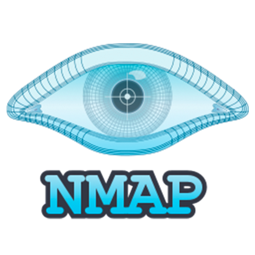

# 👋 Hi, I'm Raghav Raj Thakur  

🎓 Final Year | Bachelor of Information Technology  
**Cyber Security Major | Software Development **  
📍 Geelong, Australia  

---

## 🔐 Cybersecurity 
- 🛡️ Penetration Testing & Ethical Hacking → Kali Linux, Nmap, Metasploit, Burp Suite  
- 📡 Network Security & Forensics → Wireshark, Packet Analysis, pfSense  
- 🔍 Digital Investigations → Email & Mobile Forensics, Steganography, Vulnerability Scanning  
- ⚙️ Security Practices → Authentication, secure coding, risk assessment  

---

## 💻 Development 
- 📱 Android Apps → Chess App, Smishing Detection App  
- 🌐 Web Development → HTML, CSS, JavaScript, Node.js  
- ⚡ Scripting & Automation → Python (security scripts, automation)  
- 🎯 Projects → Capstone + Freelancing Hub  

## 🛠️ Tech Stack

  <!-- Core -->
  

  <!-- Cybersecurity -->
  
  
  
  

---
